---
# https://vitepress.dev/reference/default-theme-home-page
layout: home

hero:
  name: "Média tár"
  tagline: Itt megtalálja Nagykedével kapcsolatos videókat, képeket!
---

# Fényképek
---
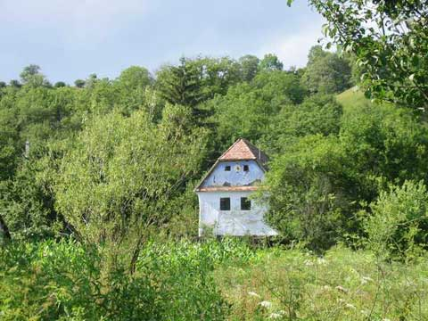

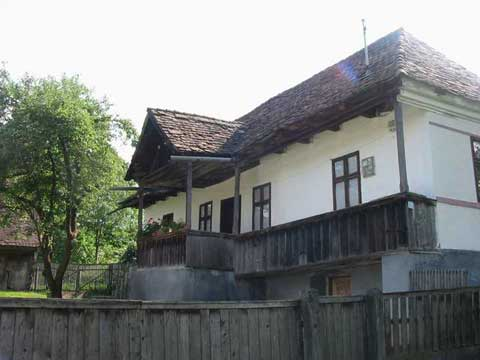

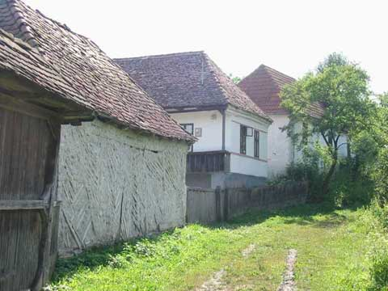

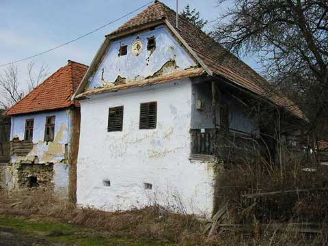

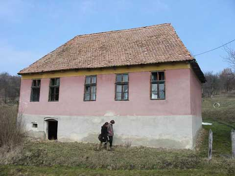

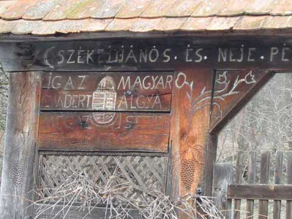

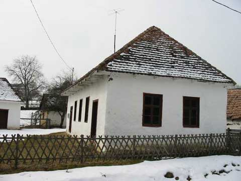

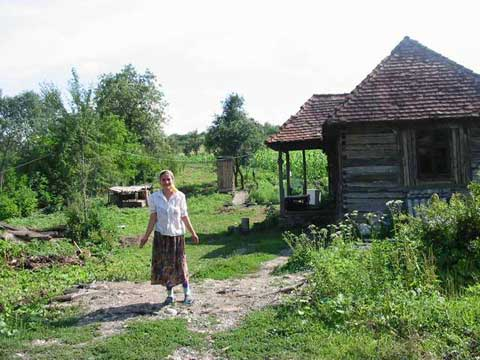

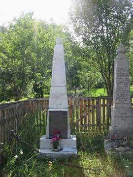

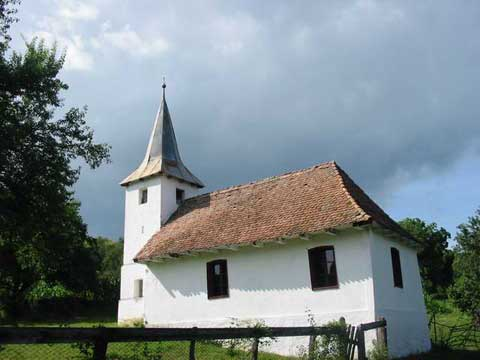

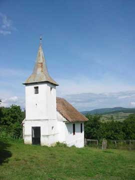

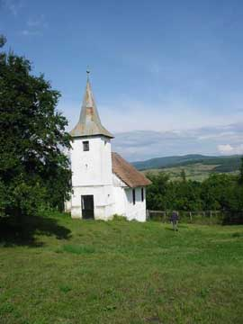

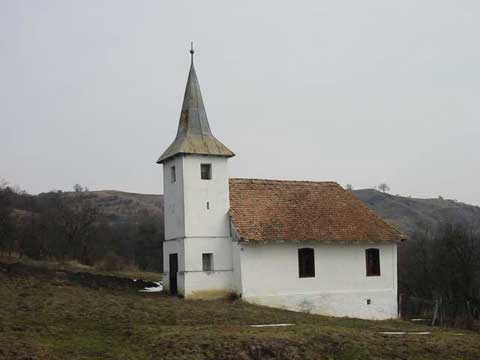

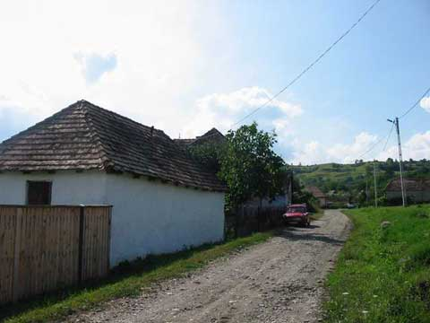

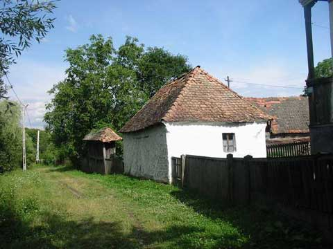

[//]: # (
)

[//]: # ()
[//]: # (  
)

[//]: # (    )

[//]: # (    
Kép 1 leírása
)

[//]: # (  
)

[//]: # ()
[//]: # (  
)

[//]: # (    )

[//]: # (    
Kép 1 leírása
)

[//]: # (  
)

[//]: # ()
[//]: # (
)

[//]: # (    )

[//]: # (    
Kép 1 leírása
)

[//]: # (  
)

[//]: # ()
[//]: # (  
)

[//]: # (    )

[//]: # (    
Kép 1 leírása
)

[//]: # (  
)

[//]: # ()
[//]: # (  
)

[//]: # (    )

[//]: # (    
Kép 1 leírása
)

[//]: # (  
)

[//]: # ()
[//]: # (  
)

[//]: # (    )

[//]: # (    
Kép 1 leírása
)

[//]: # (  
)

[//]: # ()
[//]: # (  
)

[//]: # (    )

[//]: # (    
Kép 1 leírása
)

[//]: # (  
)

[//]: # ()
[//]: # (  
)

[//]: # (    )

[//]: # (    
Kép 1 leírása
)

[//]: # (  
)

[//]: # (  )
[//]: # (  
)

[//]: # (    )

[//]: # (    
Kép 1 leírása
)

[//]: # (  
)

[//]: # ()
[//]: # (  
)

[//]: # (    )

[//]: # (    
Kép 1 leírása
)

[//]: # (  
)

[//]: # ()
[//]: # (
)

Forrás: https://www.simenfalva.ro/html-web/nagykede/index.html

[//]: # (  
)

[//]: # (    <a href="./assets/foto_12_15b.jpg" target="_blank">)

[//]: # (      )

[//]: # (    </a>)

[//]: # (    <a href="./assets/foto_12_14b.jpg" target="_blank">)

[//]: # (      )

[//]: # (    </a>)

[//]: # (    <a href="./assets/foto_12_13b.jpg" target="_blank">)

[//]: # (      )

[//]: # (    </a>)

[//]: # (    <a href="./assets/foto_12_12b.jpg" target="_blank">)

[//]: # (      )

[//]: # (    </a>)

[//]: # (    <a href="./assets/foto_12_11b.jpg" target="_blank">)

[//]: # (      )

[//]: # (    </a>)

[//]: # (    <a href="./assets/foto_12_10b.jpg" target="_blank">)

[//]: # (      )

[//]: # (    </a>)

[//]: # (    <a href="./assets/foto_12_9b.jpg" target="_blank">)

[//]: # (      )

[//]: # (    </a>)

[//]: # (    <a href="./assets/foto_12_8b.jpg" target="_blank">)

[//]: # (      )

[//]: # (    </a>)

[//]: # (    <a href="./assets/foto_12_7b.jpg" target="_blank">)

[//]: # (      )

[//]: # (    </a>)

[//]: # (    <a href="./assets/foto_12_6b.jpg" target="_blank">)

[//]: # (      )

[//]: # (    </a>)

[//]: # (    <a href="./assets/foto_12_5b.jpg" target="_blank">)

[//]: # (      )

[//]: # (    </a>)

[//]: # (    <a href="./assets/foto_12_4b.jpg" target="_blank">)

[//]: # (      )

[//]: # (    </a>)

[//]: # (    <a href="./assets/foto_12_3b.jpg" target="_blank">)

[//]: # (      )

[//]: # (    </a>)

[//]: # (    <a href="./assets/foto_12_2b.jpg" target="_blank">)

[//]: # (      )

[//]: # (    </a>)

[//]: # (    <a href="./assets/foto_12_1b.jpg" target="_blank">)

[//]: # (      )

[//]: # (    </a>)

[//]: # (  
)

[//]: # ()
[//]: # ( )

# Videók

